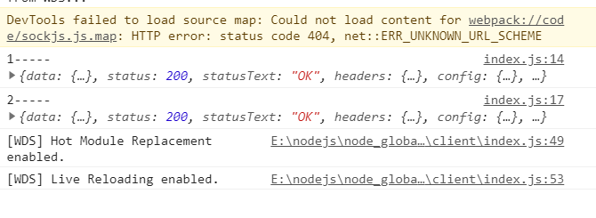
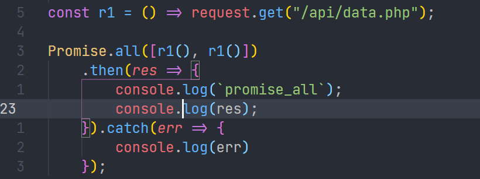
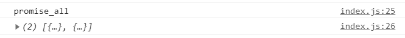
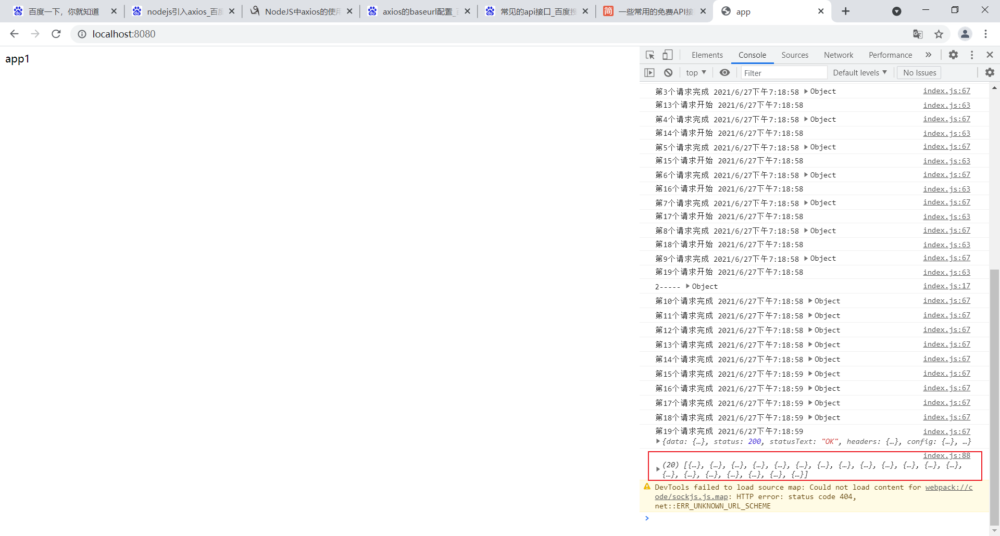

## 实现并发请求控制

参考来源： [字节跳动面试官：请用JS实现Ajax并发请求控制](https://juejin.cn/post/6916317088521027598#heading-3)

感谢[前端森林](https://juejin.cn/user/3737995267297838)

#### 题目如下

```js
实现一个批量请求函数 multiRequest(urls, maxNum)，要求如下：
• 要求最大并发数 maxNum
• 每当有一个请求返回，就留下一个空位，可以增加新的请求
• 所有请求完成后，结果按照 urls 里面的顺序依次打出
复制代码
```

这道题目我想也是比较常见的，那我们就来分析一下这道题目的场景和解析吧。

#### 常见场景

现在有30个异步请求需要发送，但由于保证游览器的性能，我们必须将同一时刻的并发请求数目控制到5个中，并尽快拿到结果。

我们应该怎么做？

首先我们得了解一下Ajax的串行和并行。

#### 基于Promise.all的并行和串行

在本文章中，我们使用的请求均是基于promise，而不是常规的回调callback。

##### 串行方法

```js
// 串行
request.get("/api/data.php")
    .then(res => {
        console.log(`1-----`, res)
        request.get("/api/data.php")
            .then(r => {
                console.log(`2-----`, r)
            })
    });
```

tip: 这里的request是模拟的请求函数.



从图中我们也可以看出，这种请求是一个接着一个执行的，逻辑上自然没有问题，适合于**后一个请求需要请一个请求返回结果的情况**。

但这个东西并非适用所有情况，因为大多情况下我们更多的场景是同时发送多个请求，即并行操作，这个时候我们可以使用`Promise.all`进行结合

##### 并行方法

主要是结合和`Promise.all`的用法，多个请求都同个返回结果数组，否则返回拒绝信息。

代码如下：



结果如下



以上我们确实实现了一个并发请求，但还有问题，上述我们的情况是针对请求量比较小得，但如果我们遇到了同时发送几十个请求的场景，那我们怎么办呢？

首先，我们不可能使用`Promise.all`同时发送30个请求，游览器的性能会吃不消，所以这时候也就有我们应该转化别的思路。

#### Promise.all并发控制

Promise.all并发控制，每个时间段的Promise数量是固定的。

#### 实现

- **思路**：

  - 将请求进行拆分成一定的数量N
  - 每次并行请求的最大数量为N
  - 当一个请求结束后，如果还有请求没有处理的，则执行请求。
  - 总：拆分成N个任务，每个任务都执行Promise 当该任务的Promise完成之后，在将其他的Promise放入进来，从而实现同时只会发生N个请求。

- ##### 代码实现

  ```js
  function multiRequest(promiseArr, maxNum) {
      // 总请求数目
      const len = promiseArr.length;
      
      // 用于保存请求的结果
      const result = new Array(len).fill(false);
      
      // 已经完成的数目
      let count = 0;
      
      return new Promise((resolve,reject) => {
          
          // 可理解添加了maxNum个任务执行next
          while(count < maxNum) {
              next();
          }
          
          // next的执行逻辑，注意这里的next之后，如果还没有结束，即还有promise未处理，则继续next，但此时，这两个next是一个串行的逻辑
          function next() {
              // 找到还没有处理的任务
              let current = count++;
              
              // 如果current超过了len 即最后一个请求也被处理了
              if(current >= len) {
                  // 如果没包含处理的，即全部完成了，则直接resolve，并结束
                  !result.includes(false) && resolve(res);
                  // 否则直接结束
                  return;
              }
              
              // 获取对应的promise 请求任务
              const p = promiseArr[current];
              console.log(`第${current}个请求开始`, new Date().toLocaleString());
  
              p().then(res => {
                  result[current] = res;
                  console.log(`第${current}个请求完成`, new Date().toLocaleString(), res);
                  // 未完成 递归
                  if (current < len) {
                      next();
                  }
              }).catch(err => {
                  
                  // 未完成 递归
                  result[current] = err;
                  console.log(`第${current}个请求出错`, new Date().toLocaleString());
                  // 未完成 递归
                  if (current < len) {
                      next();
                  }
              })
          }
      })
  }
  
  const promiseArr = new Array(20).fill(() => r1());
  multiRequest(promiseArr, 10).then(res => {
      console.log(res);
  })
  ```

  **结果**：

  

**以上就是总体的实现，即将任务拆分给N个人，让N个人去进行执行一个异步任务，当一个人执行完之后，再让这个人执行另外异步任务，从而保证一个时间段只有N个异步请求。**