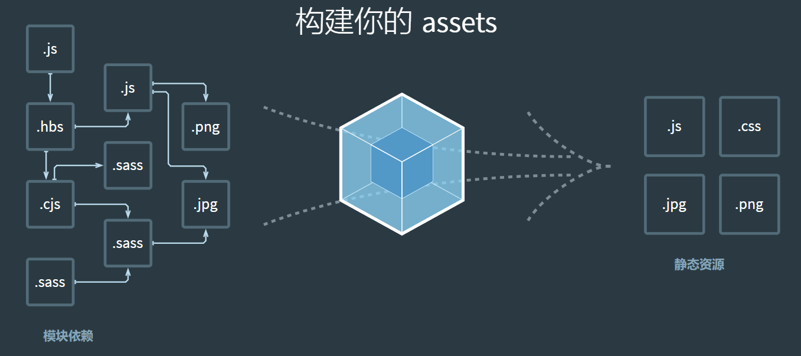

## Webpack

#### 前言

说到`webpack`，这款作为当今最热门的打包工具之一，可能是既陌生又熟悉。

我们熟悉它在我们的多数项目中得以应用与配置，但陌生在于我们并不清楚他们之间的原理。

而当我们平常使用`vue-cli`等基于webpack的脚手架时，`webpack`的本质离我们更加的遥远

#### 对于webpack的理解

大致上有以下几点：

- 模块打包：可以将不同的模块文件打包整合在一起，同时保证他们之间的正确引用，执行有序，利用打包特性，我们可以根据开发的需要划分代码文件模块，保证项目结构清晰合理。
- 编译兼容：在以前，由于js的一些api或者特性并非都能兼容所有的游览器，比如，有些游览器并不支持`es6`的代码，以前需要手写兼容，常见的方法时`polufill`,但在webpack中，你可以使用loader，如babel，不仅可以对代码进行兼容，同时还可以编译其他类型文件，提高开发效率。
- 能力扩展：通过webpack的plugin机制，在实现模块化打包基础和编译兼容的基础上，实现按需加载，代码压缩等功能，进一步提高自动化程度。

#### Webpack的5大核心

- entry：入口指定webpack打包的入口文件，并以此文件来构建依赖图。
- output：告诉webpack输出打包后文件的路径，以及如何去命名。
- loader：webpack只认识js和json文件，无法自己处理其他类型的文件，而可以通过使用对应的loader，让webpack去处理对应类型的文件，并转化为有效的模块，让应用程序使用，并添加到依赖图中。
- plugin：插件用于执行更广泛的内容，webpack在打包过程中，会触发不同的生命周期钩子，对应的plugin会在相应的生命周期，执行相应的功能，如打包优化，资源管理，注入环境变量。
- mode：三个值`development`,`production`,`none`，默认值为`production`