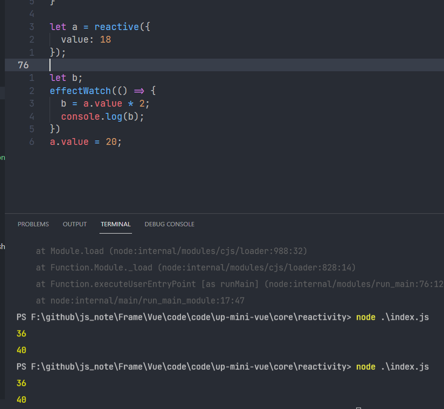

# Vue3中Reactivity

#### 前言引出

#### 需求

有这样一个需求，a和b有关联关系，要求a变化的时候，b也跟着变化，详细一点，b永远是a的两倍。（b = 2 * a）;

#### 方案

#### v1

每次a改变的代码后，加上b代码的改变的逻辑。

操作简单，但十分繁琐。

```js
let a = 10;
let b = a * 2;
a = 20;
b = a * 2;
```

#### v2

使用函数调用

操作简单，但十分繁琐。

```js
let a = 10;
let b;
update();
function update() {
  b = a + 10;
  console.log(b);
}
a = 20;
update();
```

#### v3

声明响应式对象进行调用, 借助`@vue/reactivity`

```js
const { effect, reactive } = require("@vue/reactivity");

let a = reactive({
  value: 1
});
let b;
effect(() => {
  b = a.value + 10;
  console.log(b);
});

a.value = 30;
```

问题来了，我们如何实现一个自己的响应式呢。

我们需要使用到依赖收集，当我们的变量在某一时刻收集到自己的依赖，并在之后的某一时刻，将触发依赖变更。

#### 第一步，发布订阅

```js
let currentEffect;

class Dep {
  constructor(val) {
    // 避免收集到重复的依赖
    this.effects = new Set();
    this._val = val;
  }

  // 收集依赖
  depend() {
    if (currentEffect)
      this.effects.add(currentEffect);
  }

  // 通知依赖更新
  notice() {
    this.effects.forEach(effect => {
      effect();
    })
  }
}
```

此处定义了currentEffect是为了存放当前全局的effect

#### 第二步 effectWacth

```js
function effectWatch(effect) {
  currentEffect = effect;
  effect();
  currentEffect = null; 
}
```

#### 第三步 拦截dep的getter和setter

拦截dep的value的setter和getter，使得

getter触发的时候收集依赖

setter之后通知依赖发生改变。

```js
class Dep {
  constructor(val) {
    // 避免收集到重复的依赖
    this.effects = new Set();
    this._val = val;
  }

  get value() {
    this.depend();
    return this._val;
  }

  set value(val) {
    this._val = val;
    this.notice();
  }

  // 收集依赖
  depend() {
    if (currentEffect)
      this.effects.add(currentEffect);
  }

  // 通知依赖更新
  notice() {
    this.effects.forEach(effect => {
      effect();
    })
  }
}
```

以上实现的原始值的一个响应式封装，结果如下


是不是有点类似ref，我们接着实现reactivite

## reactive

reactive一般为对象值，当我们改变了对象的属性的值的时候，他会调用相关的依赖，所以我们这个时候我们可以一个key对应一个dep，一个对应一个收集。

那我们如何做到什么时候更新，什么时候收集呢

Vue2使用了Object.definedProperty来劫持，而Vue3使用Proxy来劫持。

我们这也是用Proxy

```js
const targetMap = new Map();

function reactive(raw) {
  return new Proxy(raw, {
    get(target, key) {
      let dep = getDep(target, key);
      // 依赖收集
      dep.depend();
      return Reflect.get(target, key);
    },
    set(target, key, value) {
      let result = Reflect.set(target, key, value);
      let dep = getDep(target, key);
      // 通知依赖
      dep.notice();
      return result;
    }
  })
}

function getDep(target, key) {
  let depsMap = targetMap.get(target);
  if (!depsMap) {
    depsMap = new Map();
    targetMap.set(target, depsMap);
  }
  let dep = depsMap.get(key);
  if (!dep) {
    dep = new Dep();
    depsMap.set(key, dep);
  }
  return dep;
}
```

完成，如下图



最终进行导出

```js
module.exports = {
  reactive,
  effectWatch
}
```

运行结果


## reactivity完整代码

```js
let currentEffect;
class Dep {
  constructor(val) {
    // 避免收集到重复的依赖
    this.effects = new Set();
    this._val = val;
  }

  get value() {
    this.depend();
    return this._val;
  }

  set value(val) {
    this._val = val;
    this.notice();
  }

  // 收集依赖
  depend() {
    if (currentEffect)
      this.effects.add(currentEffect);
  }

  // 通知依赖更新
  notice() {
    this.effects.forEach(effect => {
      effect();
    })
  }
}

function effectWatch(effect) {
  currentEffect = effect;
  effect();
  currentEffect = null;
}

function getDep(target, key) {
  let depsMap = targetMap.get(target);
  if (!depsMap) {
    depsMap = new Map();
    targetMap.set(target, depsMap);
  }
  let dep = depsMap.get(key);
  if (!dep) {
    dep = new Dep();
    depsMap.set(key, dep);
  }
  return dep;
}

const targetMap = new Map();

function reactive(raw) {
  return new Proxy(raw, {
    get(target, key) {
      let dep = getDep(target, key);
      // 依赖收集
      dep.depend();
      return Reflect.get(target, key);
    },
    set(target, key, value) {
      let result = Reflect.set(target, key, value);
      let dep = getDep(target, key);
      // 通知依赖
      dep.notice();
      return result;
    }
  })
}

module.exports = {
  reactive,
  effectWatch
}
```