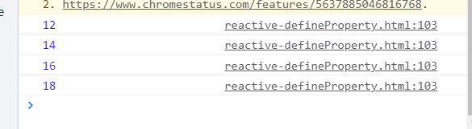

# Vue 3 Deep Dive with Evan You


来和尤大大一起深入学习VUE3吧。

## 前言

#### 说明：

这个视频的一些前置条件

- 对JavaScript有一定的基础，比较能够理解API的用法以及用意。
- 对Vue3的有一定认识，并明白Vue3的核心原理。
- 充满热爱的心💪

## 一、整体流程


1. 首先，模板编译器将HTML模板转化成render function
2. 数据响应模块将数据对象初始化响应式数据对象
3. 渲染模块中
   1. RenderPhase：渲染模块根据渲染函数初始化生成虚拟DOM。
   2. MountPhase: 利用虚拟DOM创建页面视图
   3. PatchPhase：数据模型一旦变化，渲染函数会再次被调用生成新的虚拟DOM，通过diff算法更新视图。

## 二、三大模块


- 数据响应式模块
- 编译器模块
- 渲染模块

1. #### 数据响应式模块

   提供创建数据响应式的方法。

   

2. #### 编译模块

   将模板编译成render函数

   这个编译过程可以在以下两个时刻执行

   - 浏览器运行时 (runtime)
   - Vue项目打包编译时 (compile time)

   

3. #### 渲染函数

   渲染函数通过以下三个周期将视图渲染到页面上

   - Render Phase
   - Mount Phase
   - Patch Phase

## 三、虚拟DOM

### 1.什么是DOM

DOM(Document Object Model)


HTML在浏览器中会映射为一些列节点，方便我们去调用。


### 2.什么是虚拟DOM

我们都知道，原生DOM元素功能属性非常多，导致我们查询或者更新DOM的时候消耗很大的性能，使得性能比较低。

而虚拟DOM就是用JavaScript来对真实DOM进行一个抽象和描述。

实质：用JS表示实际DOM的对象。


### 3.什么是渲染函数

在Vue渲染视图模块中，我们知道，无论是我们写的render函数或者是template，最终都会转化成render function, 再通过render function转化成Vdom


一般写法如下

```js
render(h) {
    return h(tag, props, children);
}
```

那这里的h函数是的作用是：**形成虚拟DOM**

这里对虚拟DOM的生成做简化

```js
function h(tag, props, children) {
    return {
        tag,
        props,
        children
    }
}
```

我们注意上方函数，实际上渲染的就是一个vnode。

### 4.如何挂载

此处做一个简略的写法，实现mount

我们知道，实际上我们mount的时候我们应该去创建真实的DOM节点，并进行挂载

```js
function mount(vnode, container) {
  	mountElement(vnode, container);
}

function mountElement(vnode, container) {
    const { tag, props, children } = vnode;
    // 1. tag
    let el = vnode.el = document.createElement(tag);

    // 2.props
    if (props) {
        Object.keys(props).forEach(key => {
        el.setAttribute(key, props[key]);
        })
    }

    // 3. children
    if (children) {
        if (["string", "number"].includes(typeof children)) {
            el.textContent = children;
        } else if (Array.isArray(children)) {
            children.forEach(child => {
                if (child.tag) {
                    mountElement(child, el);
                }else {
                    el.textContent = child;
                }
            })
        }
    }
    container.appendChild(el);
}
```

### 5. 通过DomDiff高效更新视图

通过对比最小的变动，去直接给dom节点打补丁，而非改变整个节点。


### 6.总结

以性能最优的方式去进行修改。


## 四、数据响应实现

### 1.什么是数据响应

#### 举个例子

有这样一个需求，a和b有关联关系，要求a变化的时候，b也跟着变化，详细一点，b永远是a的两倍。（b = 2 * a）;

#### 方案

#### v1

每次a改变的代码后，加上b代码的改变的逻辑。

操作简单，但十分繁琐。

```js
let a = 10;
let b = a * 2;
a = 20;
b = a * 2;
```

#### v2

使用函数调用

操作简单，但十分繁琐。

```js
let a = 10;
let b;
update();

function update() {
  b = a + 10;
  console.log(b);
}
a = 20;
update();
```

#### v3

声明响应式对象进行调用, 借助`@vue/reactivity`

```js
const { effect, reactive } = require("@vue/reactivity");

let a = reactive({
  value: 1
});
let b;
effect(() => {
  b = a.value + 10;
  console.log(b);
});

a.value = 30; // b = 40
```

问题来了，Vue3是如何实现的呢？

### 2.Vue3响应式的实现

Vue实现数据响应的原理是利用了数据劫持，同时也采用了观察者模式。

#### 数据劫持：

Vue2使用的是ES5的Object.defineProperty（劫持对象上的每一个属性）

Vue3则采用的是ES6的Proxy（直接代理整个对象，劫持整个对象）

希望你能先熟悉这两个api的用法及其意图

- Object.defineProperty(https://developer.mozilla.org/zh-CN/docs/Web/JavaScript/Reference/Global_Objects/Object/defineProperty)
- Proxy(https://developer.mozilla.org/zh-CN/docs/Web/JavaScript/Reference/Global_Objects/Proxy)

#### 观察者模型：

Dep可以简单理解为Set，存放dep对应的effect。

Vue3对应的数据可以建立一个代理对象，每个代理对象上有很多的键，每个键会对应一个Dep，代理对象用了Map去维护自身的Deps，即depsMap，同时，我们有很多的对象，我们直接使用全局的targetMap来存储。


#### 数据响应=数据劫持 + 观察者模型

思路：将每个对象进行代理，并且给每个对象的键都会设置好对应的dep，当我们的对象被访问时候，我们对应Proxy中的**traps**会进行拦截。

当我们访问时，我们会触发他的**getter**，这时候我们的dep就可以去收集依赖。

当我们修改时，我们会触发他的**setter**，这时候我们去通知依赖进行更新。

注：在收集依赖的时候我们需要使用全局变量来存放当前的依赖。

### 3.Vue3响应式的简单实现

这里只是按照思路，并没有完整实现，完整请阅读Vue3源码。

代码如下：

```js
let activeEffect;

const targetMap = new WeakMap();

function getDep(target, key) {
  let depsMap = targetMap.get(target);
  if (!depsMap) {
    depsMap = new Map();
    targetMap.set(target, depsMap);
  }
  let dep = depsMap.get(key);
  if (!dep) {
    dep = new Set();
    depsMap.set(key, dep);
  }
  return dep;
}

function track(target, key) {
  if (activeEffect) {
    let dep = getDep(target, key);
    dep.add(activeEffect);
  }
}

function trigger(target, key) {
  let dep = getDep(target, key);
  dep.forEach(effect => {
    effect();
  })
}

const reactiveHandler = {
  get(target, key, receiver) {
    track(target, key);
    return Reflect.get(target, key, receiver);
  },
  set(target, key, value, receiver) {
    const oldValue = target[key];
    const result = Reflect.set(target, key, value, receiver);
    if (oldValue !== value) {
      trigger(target, key);
    }
    return result;
  }
}

function reactive(raw) {
  return new Proxy(raw, reactiveHandler);
}

function watchEffect(effect) {
  activeEffect = effect;
  effect();
  activeEffect = null;
}

const a = reactive({
  value: 6
});

let b;

watchEffect(() => {
  b = a.value * 2;
  console.log(b);
})

a.value++;

a.value++;

a.value++;

a.value++;
```

结果如下



我们达到我们的预取结果，同时，其实我们看到effect中你可以中很多的时，比如，你可以去使得你的编译器根据你的数据去进行更新。

so 就可以达到数据变化，视图也跟着改变的效果。