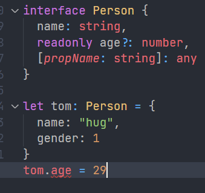

# Interfaces

在 TypeScript 中，我们使用接口（Interfaces）来定义对象的类型。

## 什么是接口

在面向对象语言中，接口（Interfaces）是一个很重要的概念，它是对行为的抽象，而具体如何行动需要由类（classes）去实现（implement）。

TypeScript 中的接口是一个非常灵活的概念，除了可用于[对类的一部分行为进行抽象](https://ts.xcatliu.com/advanced/class-and-interfaces.html#类实现接口)以外，也常用于对「对象的形状（Shape）」进行描述。

#### Demo

## 简单的例子[§](https://ts.xcatliu.com/basics/type-of-object-interfaces.html#简单的例子)

```ts
interface Person {
    name: string;
    age: number;
}

let tom: Person = {
    name: 'Tom',
    age: 25
};
```

上面的例子中，我们定义了一个接口 `Person`，接着定义了一个变量 `tom`，它的类型是 `Person`。这样，我们就约束了 `tom` 的形状必须和接口 `Person` 一致。

接口一般首字母大写。[有的编程语言中会建议接口的名称加上 `I` 前缀](https://msdn.microsoft.com/en-us/library/8bc1fexb(v=vs.71).aspx)。

定义的变量比接口少了一些属性是不允许的：

```ts
interface Person {
    name: string;
    age: number;
}

let tom: Person = {
    name: 'Tom'
};

// index.ts(6,5): error TS2322: Type '{ name: string; }' is not assignable to type 'Person'.
//   Property 'age' is missing in type '{ name: string; }'.
```

多一些属性也是不允许的：

```ts
interface Person {
    name: string;
    age: number;
}

let tom: Person = {
    name: 'Tom',
    age: 25,
    gender: 'male'
};

// index.ts(9,5): error TS2322: Type '{ name: string; age: number; gender: string; }' is not assignable to type 'Person'.
//   Object literal may only specify known properties, and 'gender' does not exist in type 'Person'.
```

可见，**赋值的时候，变量的形状必须和接口的形状保持一致**。

### 可选属性

有时我们希望不要完全匹配一个形状，那么可以用可选属性：

```ts
interface Person {
    name: string;
    age?: number;
}

let tom: Person = {
    name: 'Tom'
};
interface Person {
    name: string;
    age?: number;
}

let tom: Person = {
    name: 'Tom',
    age: 25
};
```

可选属性的含义是该属性可以不存在。

这时**仍然不允许添加未定义的属性**：

```ts
interface Person {
    name: string;
    age?: number;
}

let tom: Person = {
    name: 'Tom',
    age: 25,
    gender: 'male'
};
```

## 任意属性[§](https://ts.xcatliu.com/basics/type-of-object-interfaces.html#任意属性)

有时候我们希望一个接口允许有任意的属性，可以使用如下方式：

```ts
interface Person {
    name: string;
    age?: number;
    [propName: string]: any;
}

let tom: Person = {
    name: 'Tom',
    gender: 'male'
};
```

使用 `[propName: string]` 定义了任意属性取 `string` 类型的值。

需要注意的是，**一旦定义了任意属性，那么确定属性和可选属性的类型都必须是它的类型的子集**：

一个接口中只能定义一个任意属性。如果接口中有多个类型的属性，则可以在任意属性中使用联合类型：

```ts
interface Person {
    name: string;
    age?: number;
    [propName: string]: string | number;
}

let tom: Person = {
    name: 'Tom',
    age: 25,
    gender: 'male'
};
```

**注意，只读的约束存在于第一次给对象赋值的时候，而不是第一次给只读属性赋值的时候**：

