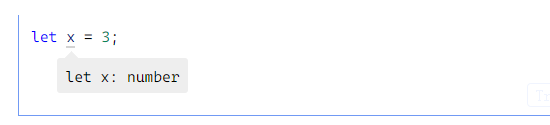
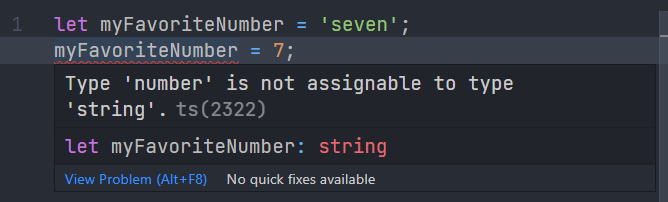

## Type Inference

If the type is not explicitly specified, ts will infer a type according the rule of Type Inference.

Like this.



### What is type inferecnce

```ts
let myFavoriteNumber = 'seven';
myFavoriteNumber = 7;
```

also like this

```ts
let myFavoriteNumber: string = 'seven';
myFavoriteNumber = 7;
```



TypeScript 会在没有明确的指定类型的时候推测出一个类型，这就是类型推论。

**如果定义的时候没有赋值，不管之后有没有赋值，都会被推断成 `any` 类型而完全不被类型检查**：

```ts
let myFavoriteNumber;
myFavoriteNumber = 'seven';
myFavoriteNumber = 7;
```