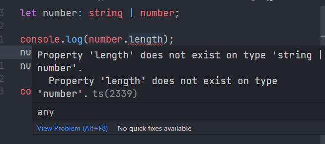

## Union Types

联合类型（Union Types）表示取值可以为多种类型中的一种。

## 简单的例子[§](https://ts.xcatliu.com/basics/union-types.html#简单的例子)

```ts
let myFavoriteNumber: string | number;
myFavoriteNumber = 'seven';
myFavoriteNumber = 7;
let myFavoriteNumber: string | number;
myFavoriteNumber = true;

// index.ts(2,1): error TS2322: Type 'boolean' is not assignable to type 'string | number'.
//   Type 'boolean' is not assignable to type 'number'.
```


联合类型使用 `|` 分隔每个类型。

这里的 `let myFavoriteNumber: string | number` 的含义是，允许 `myFavoriteNumber` 的类型是 `string` 或者 `number`，但是不能是其他类型。

## 访问联合类型的属性或方法[§](https://ts.xcatliu.com/basics/union-types.html#访问联合类型的属性或方法)

当 TypeScript **不确定**一个联合类型的变量到底是哪个类型的时候，我们**只能访问此联合类型的所有类型里共有的属性或方法**：

```ts
function getLength(something: string | number): number {
    return something.length;
}

// index.ts(2,22): error TS2339: Property 'length' does not exist on type 'string | number'.
//   Property 'length' does not exist on type 'number'.
```

上例中，`length` 不是 `string` 和 `number` 的共有属性，所以会报错。



访问 `string` 和 `number` 的共有属性是没问题的：

```ts
function getString(something: string | number): string {
    return something.toString();
}
```

联合类型的变量在被赋值的时候，会根据类型推论的规则推断出一个类型:

```ts
let myFavoriteNumber: string | number;
myFavoriteNumber = 'seven';
console.log(myFavoriteNumber.length); // 5
myFavoriteNumber = 7;
console.log(myFavoriteNumber.length); // 编译时报错

// index.ts(5,30): error TS2339: Property 'length' does not exist on type 'number'.
```

上例中，第二行的 `myFavoriteNumber` 被推断成了 `string`，访问它的 `length` 属性不会报错。

而第四行的 `myFavoriteNumber` 被推断成了 `number`，访问它的 `length` 属性时就报错了。

