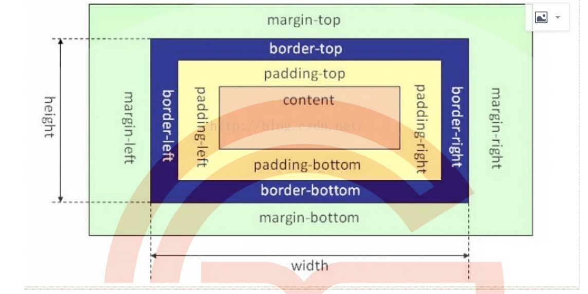

### CSS面试题

1. **说一下css盒模型**

   答：就是用于装页面上元素的一个矩形区域，包括IE盒子模型和标准W3C盒子模型。

   

   ie盒子模型和W3C盒子模型区别：

   - 标准盒子模型中: width = content
   - ie盒子模型中:width=content+padding+border

   box-sizing:

   - content-box;标准盒子模型
   - border-box;IE盒子模型
   - padding-box:这个属性包含左右的padding和width

2. **画一条0.5px的线**

   ```html
   <!DOCTYPE html>
   <html lang="en">
   <head>
       <meta charset="UTF-8">
       <meta http-equiv="X-UA-Compatible" content="IE=edge">
       <meta name="viewport" content="width=device-width, initial-scale=1.0">
       <title>Document</title>
       <style>
           .hr{
               height: 1px;
               background: black;
           }
           .scale-half {
               transform: scaleY(0.5);
               transform-origin: 50% 100%;
           }
           .linear-gradient {
               background: linear-gradient(0deg, #fff, #000);
           }
           .boxshadow {
               background: none;
               box-shadow: 0 0.5px 0 #000;
           }
       </style>
   </head>
   <body>
       <div>
           <p>0.5px(scale)</p>
           <div class="hr scale-half"></div>
       </div>
   
       <div>
           <p>0.5px(linear-gradient)</p>
           <div class="hr linear-gradient"></div>
       </div>
   
       <div>
           <p>0.5px(boxshadow)</p>
           <div class="hr boxshadow"></div>
       </div>
   </body>
   </html>
   ```

   transform-origin

   linear-gradient

   boxshadow

3. **FLEX布局**

4. **BFC(块级格式化上下文，用于清除浮动，防止margin重叠)**

   Block Formatting Context 块级格式化上下文

   BFC是一个完成独立的空间，空间里的子元素不影响外面的布局。

5. 