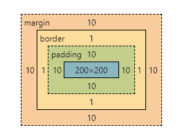
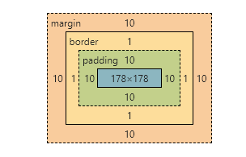

### 盒模型

任何CSS元素都可以看成盒子。由四部分组成: 内容(content)、内边距(padding)、边框(border)、外边距(margin);

盒模型有 2 种：

- 标准盒模型(W3C制定的标准)
- IE盒模型(IExplore 制定的标准)

```css
.box{
    width: 200px;
    height: 200px;
    padding: 10px;
    border: 1px solid #eee;
    margin: 10px;
}
```

标准盒模型

盒子的实际尺寸 = 内容（设置的宽/高） + 内边距 + 边框



所以`.box`的`content:200` 

实际宽度 = `content`+`padding-left`+`padding-right`+`border-left`+`border-right`=200+10+10+1+1=222。

IE盒模型

盒子实际尺寸=设置的宽/高=内容+内边距+边框

即实际宽度=`content` + `padding-left` + `padding-right` + `border-left` + `border-right`;

content = 200 -  1 - 1 -10 - 10 = 178



通过box-sizing来切换

- border-box： IE盒模型。
- content-box：标准盒模型。