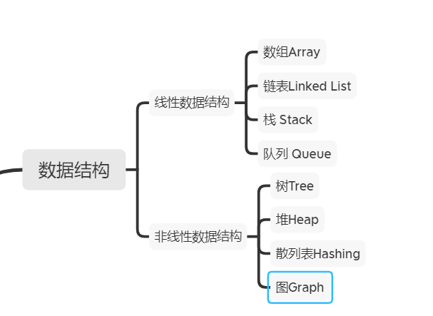
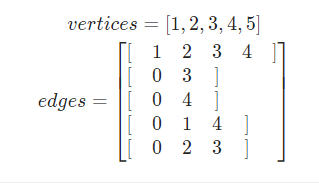
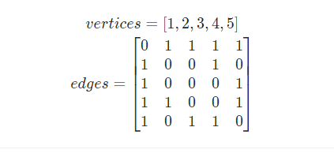

### 数据结构简介

数据结构是对计算机数据有效使用的一种抽象和组织。不同的数据结构具有各自对应的适合场景，旨在降低算法计算的时间和空间复杂度。

一般来说，常见的分为线性数据结构和非线性数据结构。



**数组**

```js
let arr = [];

arr[1] = 1;
```

**链表**

```java
class ListNode {
    int val;
    ListNode next;
    ListNode(int x) {
        val = x;
    }
}
```

**栈**(后进先出)

```js
let stack = [];
stack.push(ele);	// 入栈
stack.pop();	// 出栈
```

**队列**（先进新出）

```js
let stack = [];
statck.push(ele);
stack.unshift();
```

**树**（二叉树、多叉树）

```js
class TreeNode {
    constructor(val) {
        this.val = val;
        this.leftNode = null;
        this.rightNode = null;
    }
}
```


**图**

图是一种非线性数据结构，由【节点（顶点）vertex】和【边edge】组成，每条边连接一对顶点，同时也分为【有向图】和【无向图】。本文以无向图为例。

**顶点**和**边**集合分别为：

- 顶点集合 : `vertices = {1,2,3,4,5}`
- 边集合：`edges = {(1, 2), (1, 3), (1, 4), (1, 5), (2, 4), (3, 5), (4, 5)}`


表示形式

- 邻接表

  - 使用数组 verticesvertices 存储顶点，邻接表 edgesedges 存储边。 edgesedges 为一个二维容器，第一维 ii 代表顶点索引，第二维 edges[i]edges[i] 存储此顶点对应的边集和；例如 edges[0] = [1, 2, 3, 4]edges[0]=[1,2,3,4] 代表 vertices[0]vertices[0] 的边集合为 [1, 2, 3, 4][1,2,3,4] 。

    

- 邻接矩阵

  -  使用数组 verticesvertices 存储顶点，邻接矩阵 edgesedges 存储边； edges[i][j]edges[i][j] 代表节点 i + 1i+1 和 节点 j + 1j+1 之间是否有边。

    

- 两者区别：

  - 邻接矩阵至于节点数量有关，N^2，当边数量少于节点数量，则邻接矩阵会造成比较大的浪费。
  - 邻接表 适合存储稀疏图（顶点较多、边较少）； 邻接矩阵 适合存储稠密图（顶点较少、边较多）

**散列表**

散列表是一种非线性数据结构，通过利用 Hash 函数将指定的「键 `key`」映射至对应的「值 `value`」，以实现高效的元素查找。


考虑低碰撞率、高鲁棒性。

**堆**

堆是一种基于「完全二叉树」的数据结构，可使用数组实现。以堆为原理的排序算法称为「堆排序」，基于堆实现的数据结构为「优先队列」。堆分为「大顶堆」和「小顶堆」，大（小）顶堆：任意节点的值不大于（小于）其父节点的值。

