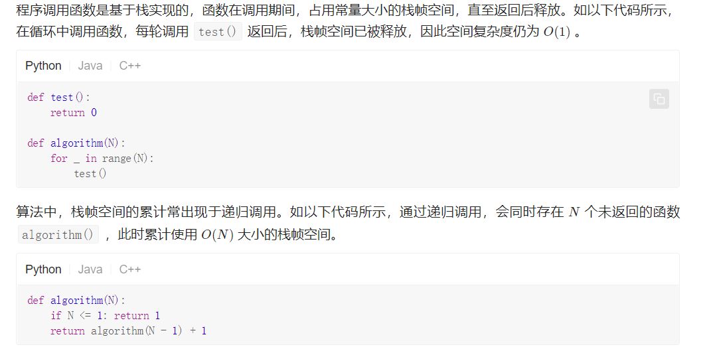
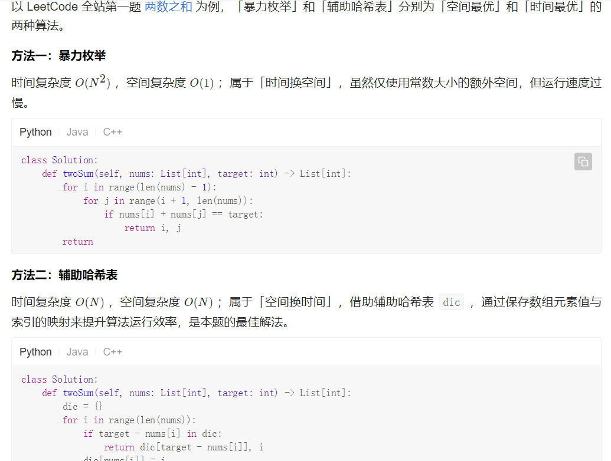

+ #### 数据结构和算法
  
    + 数据结构是ADT（抽象数据类型Abstract Data Type）的物理实现
    + 数据结构和语言无关。
    + 栈 Stack
    + 队列 Queue
    + 链表 LinkedList
    + 集合 Set
    + 字典 Dictionary
    + 哈希表 HashTable
    + 树 Tree

- #### 递归和迭代的区别

  - 递归：就是在运行的过程中调用自己
    - 条件
      - 子问题需要和原始问题为同样的事，见更为简单
      - 不能无限制调用本身，必须要有出口，化简为非递归状况处理
    - 思想：
      - 调用自身的编程思想，一个函数调用自己本身
  - 迭代：
    - 不断用变量的旧值递推出新值的过程，即一次性解决问题。
    - 思想：利用已知的变量值，根据递推公式不断演进得到变量新值的编程思想。
  - 迭代和普通
    - **迭代与普通循环的区别是：迭代时，循环代码中参与运算的变量同时是保存结果的变量，当前保存的结果作为下一次循环计算的初始值。**
    - **递归与普通循环的区别是：循环是有去无回，而递归则是有去有回(因为存在终止条件)**。

### 算法复杂度

- 前言：算法复杂度旨在计算在输入数据量 N*N* 的情况下，算法的「时间使用」和「空间使用」情况；体现算法运行使用的时间和空间随「数据大小 N*N* 」而增大的速度。

- 两个维度**时间复杂度**和**空间复杂度**

  - 时间复杂度： 假设各操作的运行时间为固定常数，统计算法运行的「计算操作的数量」 ，以代表算法运行所需时间；
  - 空间复杂度：统计在最差情况下，算法运行所需使用的「最大空间」；

- #### 时间复杂度

  - 概念：时间复杂度是指输入数据大小为N时，算法运行所需要花费的时间。

  - 注意：

    - 统计的是算法的「计算操作数量」，而不是「运行的绝对时间」。
    - 体现的是计算操作随数据大小 NN 变化时的变化情况。假设算法运行总共需要「 11 次操作」、「 100100 次操作」，此两情况的时间复杂度都为常数级 O(1)O(1) ；需要「 NN 次操作」、「 100N100N 次操作」的时间复杂度都为 O(N)O(N) 。

  - 符号表示

    - **最佳情况 Ω**
    - **最差情况 O**
    - **平均情况 Θ** 

  - **常见种类**

    根据从小到大排序，常见的算法时间复杂度有：

    O(1) < O(logN) < O(N) < O(NlogN) < O(N^2) < O(2^N) < O(N!)

  - **示例分析**（记住，时间复杂度是与输入的N有所相关的）

    - 常数O（1）
    - 线性O（N）
    - 平方O(N^2)
    - 指数O（2^N）
    - 阶乘O(N!)
    - 对数O*(log*N)
    - 线性对数O(NlogN)

- #### 空间复杂度

  - 涉及的空间类型有：

    - 输入空间：存储数据所需的空间大小。
    - 暂存空间：算法运行过程中，存储中所有中间变量和对象等数据所需的空间大小。
    - 输出空间：算法运行返回时，存储输出数据所需的空间大小。

    通常情况下，空间复杂度指在输入数据大小为N时，算法所使用的【暂存空间】+ 【输出空间】的总体大小

  - 内存空间分为三种

    - 数据空间

      - 算法中的各项变量使用的空间，包括：声明的常量、变量、动态数组、动态对象等使用的内存空间。

    - 指令空间

      - 编译后，程序指令所使用的内存空间。

    - 栈帧空间

      

  - **符号表示**

    - 通常情况下，空间复杂度统计算法在 “最差情况” 下使用的空间大小，以体现算法运行所需预留的空间量，使用符号 O*O* 表示。
      - **最差输入数据**
      - **最差运行点**

  - **常见种类**

    - O(1) < O(logN) < O(N) < O(N^2) < O(2^N)

      

#### 时空权衡

对于算法的性能，需要从时间和空间的使用情况来综合评价。优良的算法应具备两个特性，即时间和空间复杂度皆较低。而实际上，对于某个算法问题，同时优化时间复杂度和空间复杂度是非常困难的。降低时间复杂度，往往是以提升空间复杂度为代价的，反之亦然。

