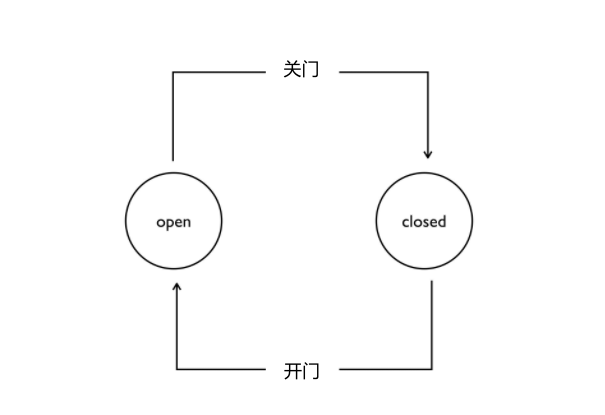

# 什么是状态机？

#### 定义：状态机是有限状态自动机的简称，是现实事物运行规则抽象而成的一个数学模型。

先来解释什么是“状态”（ State ）。现实事物是有不同状态的，例如一个自动门，就有 open 和 closed 两种状态。我们通常所说的状态机是有限状态机，也就是被描述的事物的状态的数量是有限个，例如自动门的状态就是两个 open 和 closed 。

状态机，也就是 State Machine ，不是指一台实际机器，而是指一个数学模型。说白了，一般就是指一张状态转换图。例如，根据自动门的运行规则，我们可以抽象出下面这么一个图。

自动门有两个状态，open 和 closed ，closed 状态下，如果读取开门信号，那么状态就会切换为 open 。open 状态下如果读取关门信号，状态就会切换为 closed 。

状态机的全称是有限状态自动机，自动两个字也是包含重要含义的。给定一个状态机，同时给定它的当前状态以及输入，那么输出状态时可以明确的运算出来的。例如对于自动门，给定初始状态 closed ，给定输入“开门”，那么下一个状态时可以运算出来的。

**状态机是有限状态自动机的简称，是现实事物运行规则抽象而成的一个数学模型。**

#### 四大概念

- State，状态。一个状态机至少要包含两个状态。例如上面自动门的例子，有 open 和 closed 两个状态。
- Event。事件。事件就是执行某个操作的触发条件或者口令。对于自动门，“按下开门按钮”就是一个事件。
- Action。动作。事件发生以后要执行动作。例如事件是“按开门按钮”，动作是“开门”。编程的时候，一个 Action 一般就对应一个函数。
- Transition。变换。也就是从一个状态变化为另一个状态。例如“开门过程”就是一个变换。

## 总结

这就是对状态机概念的一个通俗的简述了。总结一下，状态机不是实际机器设备，而是一个数学模型，通常体现为一个状态转换图。涉及到的相关概念是 State 状态，Event 事件，Action 动作，Transition 转换。状态机是计算机科学的重要基础概念之一，也可以说是一种总结归纳问题的思想，应用范围非常广泛。