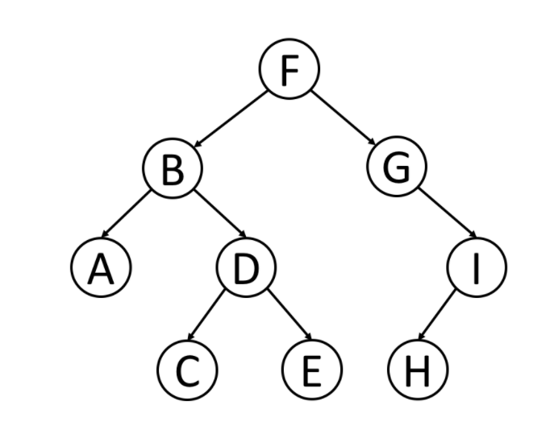

## 树

树 是一种经常用到的数据结构，用来模拟具有树状结构性质的数据集合。

树里的每一个节点有一个值和一个包含所有子节点的列表。从图的观点来看，树也可视为一个拥有N 个节点和N-1 条边的一个有向无环图。

`二叉树`是一种更为典型的树状结构。如它名字所描述的那样，二叉树是每个节点最多有`两个子树`的树结构，通常子树被称作“左子树”和“右子树”。

1. 树和二叉树
2. 遍历
3. 递归 or 迭代

### 遍历

- 理解和区分树的遍历方式
- 递归解决树的前序、中序、后序遍历
- 迭代解决树的前序、中序、后序遍历
- 广度优先（BFS）解决层序遍历

#### 前序遍历

- 顺序：根左右

- 示例

  - 
  - FBADCEGIH

- 解法

  - 递归

    - 代码

      ```js
      function preorderTraversal(root) {
        if (!root) {
          return [];
        }
        
        const res = [];
        preorder(root);
      
        function preorder(root) {
          res.push(root.val);
          if (root.left) {
            preorder(root.left);
          }
          if (root.right) {
            preorder(root.right);
          }
        }
      
        return res;
      }
      ```

    - 分析

      - 根据根左右的顺序去递归访问树
      - 时间复杂度O(n)
      - 空间复杂度O(n)

  - 非递归

    - 代码

      ```js
      function preorderTraversal(root) {
        
        if (!root) {
          return [];
        }
        
        const res = [];
        const stack = [root];
      
        while (stack.length) {
          let node = stack.pop();
          res.push(node.val);
          node.right && stack.push(node.right);
          node.left && stack.push(node.left);
        }
      
        return res;
      }
      ```

    - 分析

      - 使用堆栈，根节点出栈，右节点入栈、左节点入栈
      - 时间复杂度O(n)
      - 空间复杂度O(n)

#### 中序遍历

- 顺序:左右根

- 示例

  - 
  - ABCDEFGHI

- 解法

  - 递归

    - 代码

      ```js
      
      function inorderTraversal(root) {
        if (root === null) {
          return [];
        }
        const res = [];
      
        dfs(root);
      
        function dfs(root) {
          root.left && dfs(root.left);
          res.push(root.val);
          root.right && dfs(root.right);
        }
        return res;
      }
      ```

    - 时间复杂度O(n)

    - 空间复杂度O(n)

  - 非递归

    - 代码

      ```js
      function inorderTraversal(root) {
        if (!root) {
          return [];
        }
        const stack = [];
        const res = [];
      
        while (stack.length || root) {
          while (root) {
            stack.push(root);
            root = root.left;
          }
          root = stack.pop();
          res.push(root.val);
          root = root.right;
        }
      
        return res;
      }
      ```

    - 时间复杂度O(n)

    - 空间复杂度O(n)

#### 后序遍历

- 顺序：左右根
- 示例：
  - 
  - ACEDBHIGF

### 层序遍历

层序遍历就是逐层遍历树结构。

广度优先搜索是一种广泛运用在树或图这类数据结构中，遍历或搜索的算法。 该算法从一个根节点开始，首先访问节点本身。 然后遍历它的相邻节点，其次遍历它的二级邻节点、三级邻节点，以此类推。

当我们在树中进行广度优先搜索时，我们访问的节点的顺序是按照层序遍历顺序的。

BFS

图示：

- 

- 顺序 FBGADICEH

- 解法

  - 代码:

    ```js
    var levelOrder = function (root) {
      if (!root) {
        return [];
      }
      
      const queue = [root];
      const res = [];
    
      while (queue.length) {
        let length = queue.length;
        res.push([]);
    
        while (length) {
          let node = queue.shift();
          res[res.length - 1].push(node.val);
          node.left && queue.push(node.left);
          node.right && queue.push(node.right);
          length--;
        }
      }
      return res;
    };
    ```

  - 时间复杂度O(n)

  - 空间复杂度O(n)

### 运用递归解决树的问题

在前面的章节中，我们已经介绍了如何利用递归求解树的遍历。 递归是解决树的相关问题最有效和最常用的方法之一。

我们知道，树可以以递归的方式定义为一个节点（根节点），它包括一个值和一个指向其他节点指针的列表。 递归是树的特性之一。 因此，许多树问题可以通过递归的方式来解决。 对于每个递归层级，我们只能关注单个节点内的问题，并通过递归调用函数来解决其子节点问题。

通常，我们可以通过 “自顶向下” 或 “自底向上” 的递归来解决树问题。

#### “自顶向下” 的解决方案

“自顶向下” 意味着在每个递归层级，我们将首先访问节点来计算一些值，并在递归调用函数时将这些值传递到子节点。 所以 “自顶向下” 的解决方案可以被认为是一种前序遍历。 具体来说，递归函数 top_down(root, params) 的原理是这样的：

#### “自底向上” 的解决方案

“自底向上” 是另一种递归方法。 在每个递归层次上，我们首先对所有子节点递归地调用函数，然后根据返回值和根节点本身的值得到答案。 这个过程可以看作是后序遍历的一种。

#### 总结：

当遇到树问题时，请先思考一下两个问题

- 你能确定一些参数，从该节点自身解决出发寻找答案吗？
- 你可以使用这些参数和节点本身的值来决定什么应该是传递给它子节点的参数吗？