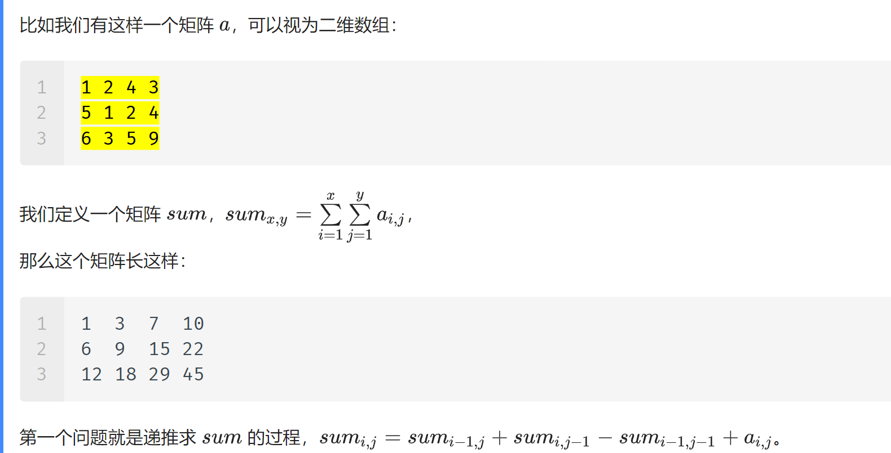
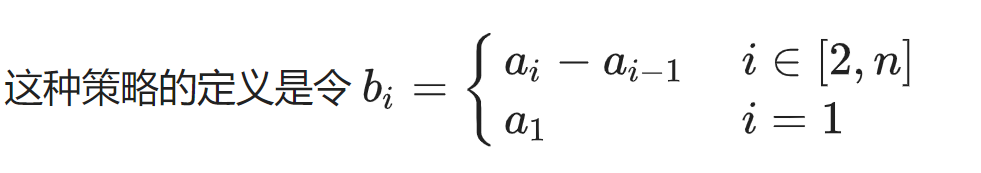
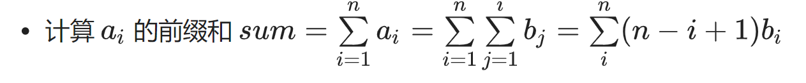
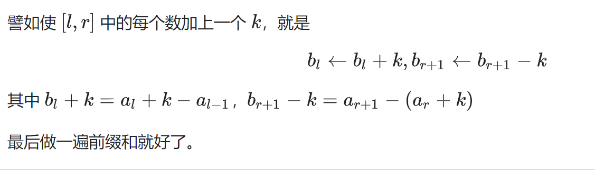

## 前缀和&差分

#### 前缀和

前缀和是一种重要的预处理，能大大降低查询的时间复杂度。可以简单理解为“数列的前n项的和”。

**例题：**

有N个的正整数放到数组A里，现在要求一个新的数组B，新数组的第i个数 是原数组A第0到第i个数的和。

- 输入

  ```js
  5
  1 2 3 4 5
  ```

- 输出

  ```js
  1 3 6 10 15
  ```

解题思路

思路一：每次去叠加计算

思路二：

​	当我们为B[i]添加元素时:

- 有两种情况当i>0,我们的B[i]的值为A上数组B[i-1] + A[i]

- 当i == 0 ,我们B[0] = A[0];

代码

```js
function tranArr(a) {
    if(a.length === 0) {
        return [];
    }
    let b = [];
    b[0] = a[0];
    
    for(let i = 1; i < a.length; i++) {
        b[i] = b[i-1] + a[i];
    }
    return b;
}
```

### 二维/多维前缀和

多维前缀和的普通求解方法几乎都是基于容斥原理。



重点 

- 公式推导：sum(i,j) = sum(i-1,j) + sum(i ,j -1) + a(i,j);
- 应用

例题：

在一个 n*m 的只包含 0 和 1 的矩阵里找出一个不包含 0 的最大正方形，输出边长。

```c++
#include <algorithm>
#include <iostream>
using namespace std;
int a[103][103];
int b[103][103];  // 前缀和数组，相当于上文的 sum[]
int main() {
  int n, m;
  cin >> n >> m;

  for (int i = 1; i <= n; i++) {
    for (int j = 1; j <= m; j++) {
      cin >> a[i][j];
      b[i][j] =
          b[i][j - 1] + b[i - 1][j] - b[i - 1][j - 1] + a[i][j];  // 求前缀和
    }
  }

  int ans = 1;

  int l = 2;
  while (l <= min(n, m)) {
    for (int i = l; i <= n; i++) {
      for (int j = l; j <= m; j++) {
        if (b[i][j] - b[i - l][j] - b[i][j - l] + b[i - l][j - l] == l * l) {
          ans = max(ans, l);
        }
      }
    }
    l++;
  }

  cout << ans << endl;
  return 0;
}
```

## 差分

差分是一种和前缀和相对的策略，可以当做是求和的逆运算。''



简单性质：

1. ai是bi的前缀和

2. 计算ai的前缀和sum

   

