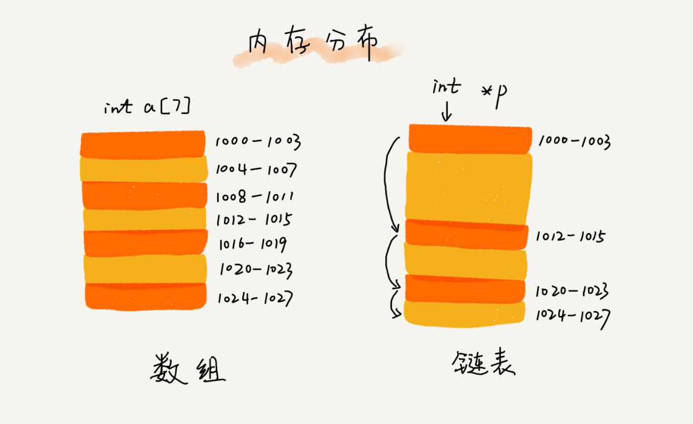

# 06 | 链表（上）：如何实现LRU缓存淘汰算法?

### 链表（Linked list）

应用：

- LRU缓存淘汰算法
  - 解释：缓存时一种提高数据读取性能的技术，在硬件设计、软件开发中都有着非常广泛的应用，比如常见的 CPU 缓存、数据库缓存、浏览器缓存等等。
  - 策略：
    - FIFO(First in First out)
    - LFU(Least Frequently)
    - LRU(Least Recently Used)

#### 与数组的不同

**底层存储结构**

- **连续的内存空间**

- **零散的内存空间**

  

#### 链表种类

- 单链表

  - 结点
  - 后继指针
  - 头结点
  - 尾结点

  

  

- 双向链表

  - 多了一个prev指针
  - 插入删除更为方便容易

  

- 循环链表

  - 特殊的单链表，尾结点的next指向头结点

  

- 双向循环链表

  

- 注意区分

  - 空间换时间
  - 时间换空间

#### 数组和链表性能方面

在实际项目中，要懂得权衡。

#### 设计思路

单链表，越靠近链表尾部的结点越早访问，当一个数据被访问的时候，我们从头遍历链表。

1. 如果此数据之前已经被缓存在链表中了，我们遍历得到这个数据对应的结点，并将其从原来的位置删除，然后再插入到链表的头部。
2. 如果此数据没有在缓存链表中，又可以分为两种情况：
   1. 如果此数据之前已经被缓存在链表中了，我们遍历得到这个数据对应的结点，并将其从原来的位置删除，然后再插入到链表的头部。
   2. 如果此数据没有在缓存链表中，又可以分为两种情况：
      - 未满，直接插入链表头部
      - 满，则链表尾结点删除，将新的数据结点插入链表的头部。

时间复杂度为O(n)

也可用哈希表

