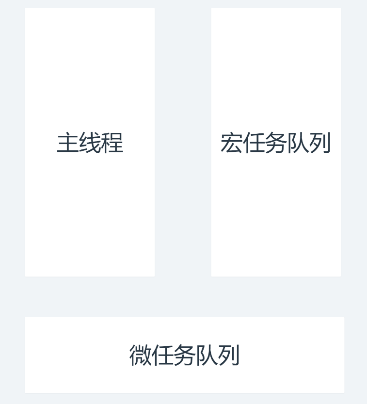

#### 宏任务与微任务

任务主次之分

优先级：微任务 > 宏任务



```html
<!DOCTYPE html>
<html lang="en">
<head>
    <meta charset="UTF-8">
    <meta http-equiv="X-UA-Compatible" content="IE=edge">
    <meta name="viewport" content="width=device-width, initial-scale=1.0">
    <title>Document</title>
</head>
<body>
    
</body>
<script>
    // 宏任务
    setTimeout(() => {
        console.log("setTimeout")
    },0)

    //微任务
    Promise.resolve().then(() => {
        console.log("promise")
    })

    //同步任务
    console.log("同步任务")
    
    //同步任务 宏任务 微任务
</script>
</html>
```

