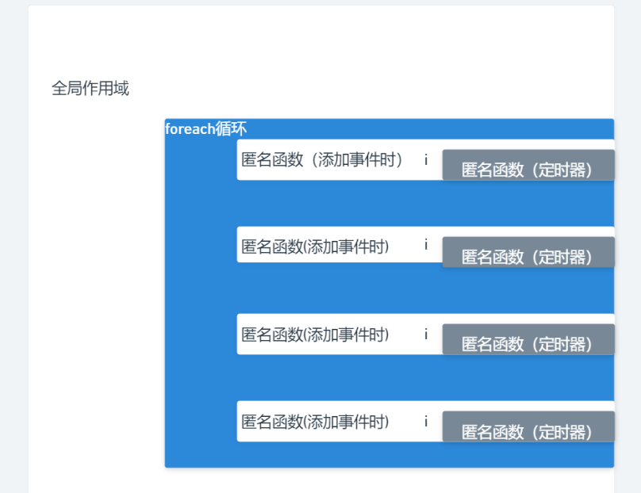

### 闭包的动画例子



```html
<!DOCTYPE html>
<html lang="en">
<head>
    <meta charset="UTF-8">
    <meta http-equiv="X-UA-Compatible" content="IE=edge">
    <meta name="viewport" content="width=device-width, initial-scale=1.0">
    <title>Document</title>
    <style>
        button{
            position: absolute;
        }
    </style>
</head>
<body>
    <button message="houdunren">houdunren</button>
    <!-- <button message="hdcms">hdcms</button> -->
</body>
<script>
    let btns = document.querySelectorAll("button");
    btns.forEach(elem => {
        elem.addEventListener('click', () => {
            let left = 1;
            setInterval(() => {
                elem.style.left = left++ + "px"                
            }, 100);
        })
    })
</script>
</html>
```

