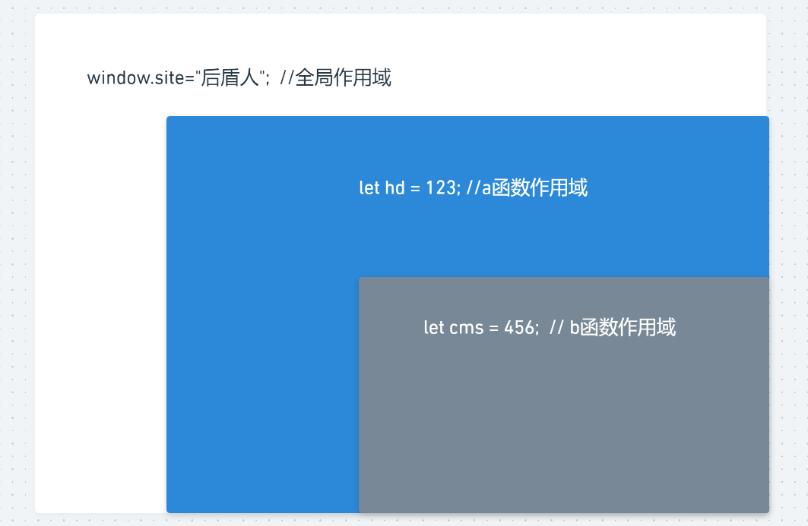

#### 函数的环境与作用域原理

函数执行后，会创建一个新的环境（内存地址） 里面存放函数终定义的变量啊 函数 这些变量只能在该函数的作用域中使用 用完就销毁



```html
<!DOCTYPE html>
<html lang="en">
<head>
    <meta charset="UTF-8">
    <meta http-equiv="X-UA-Compatible" content="IE=edge">
    <meta name="viewport" content="width=device-width, initial-scale=1.0">
    <title>Document</title>
</head>
<body>
    
</body>
<script>
    let title = "houdunren";
    function show() {
        let url = "www.baidu.com";
        function hd() {
            let site = "hdcms";
            console.log(site);
        }
        hd();
        try{
            console.log(site);
        }catch(e){
            console.log(e);
        }
        
    }
    // 函数执行后，会创建一个新的环境（内存地址） 里面存放函数终定义的变量啊 函数 这些变量只能在该函数的作用域中使用 用完就销毁
    show();
    console.log(url);
</script>
</html>
```

