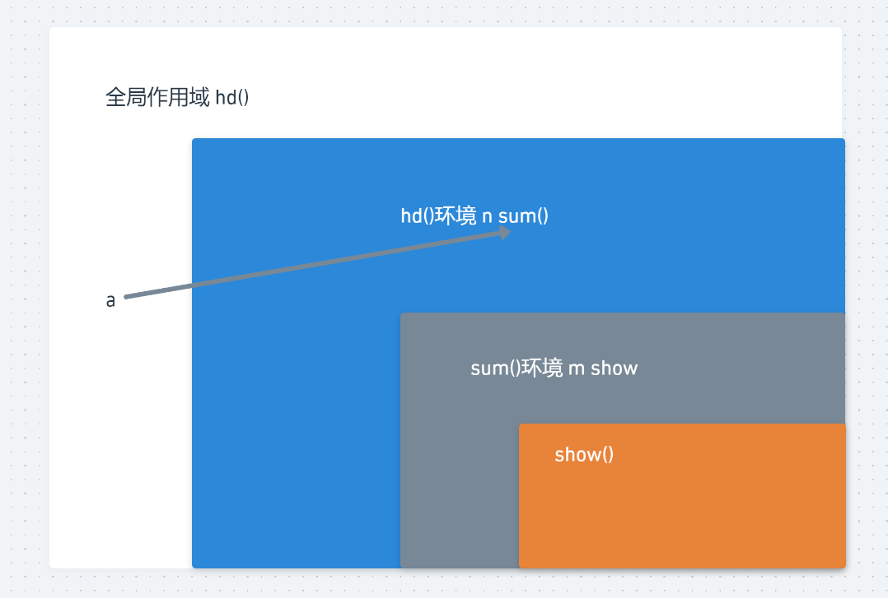

#### 延伸函数环境生命周期



```html
<!DOCTYPE html>
<html lang="en">
<head>
    <meta charset="UTF-8">
    <meta http-equiv="X-UA-Compatible" content="IE=edge">
    <meta name="viewport" content="width=device-width, initial-scale=1.0">
    <title>Document</title>
</head>
<body>
    
</body>
<script>
    function hd() {
        let n = 1;
        // 返回这个函数（引用类型）时，返回的时一个函数会有一个特定的内存空间 被使用 他当前的作用域的变量和环境是不会被清除掉的
        return function sum() {
            console.log(++n);
        }
    }
    let a = hd();
    a();
    a();
    a();
    a();
    let b = hd();
    b();
    b();
</script>
</html>
```


```html
<!DOCTYPE html>
<html lang="en">
<head>
    <meta charset="UTF-8">
    <meta http-equiv="X-UA-Compatible" content="IE=edge">
    <meta name="viewport" content="width=device-width, initial-scale=1.0">
    <title>Document</title>
</head>
<body>
    
</body>
<script>
    function hd() {
        let n = 1;
        // 返回这个函数（引用类型）时，返回的时一个函数会有一个特定的内存空间 被使用 他当前的作用域的变量和环境是不会被清除掉的
        return function sum() {
            let m = 1;
            return function show() {
                console.log("m:"+ ++m);
                console.log("n:"+ ++n);
            }
        }
    }
    let a = hd()();
    a();
    a();
</script>
</html>
```

