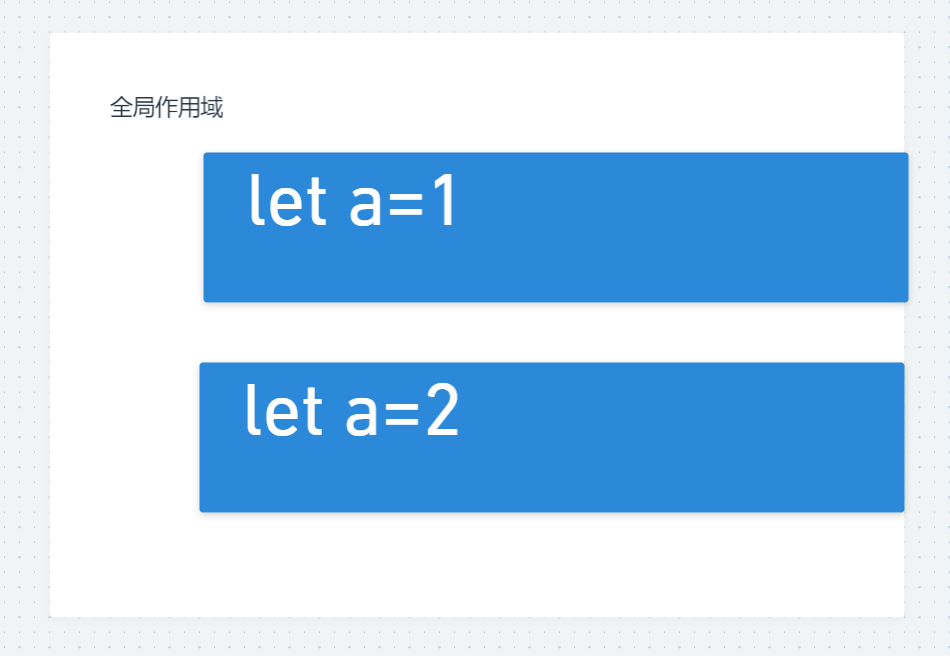

#### 块作用域

let const块级作用域

var无块级作用域

var是直接到全局作用域中的



```html
<!DOCTYPE html>
<html lang="en">
<head>
    <meta charset="UTF-8">
    <meta http-equiv="X-UA-Compatible" content="IE=edge">
    <meta name="viewport" content="width=device-width, initial-scale=1.0">
    <title>Document</title>
</head>
<body>
    
</body>
<script>
    {
        let a = 1;
        var b = 123;
    }
    console.log(window.b);
    {
        let a = 2;
    }
</script>
</html>
```

