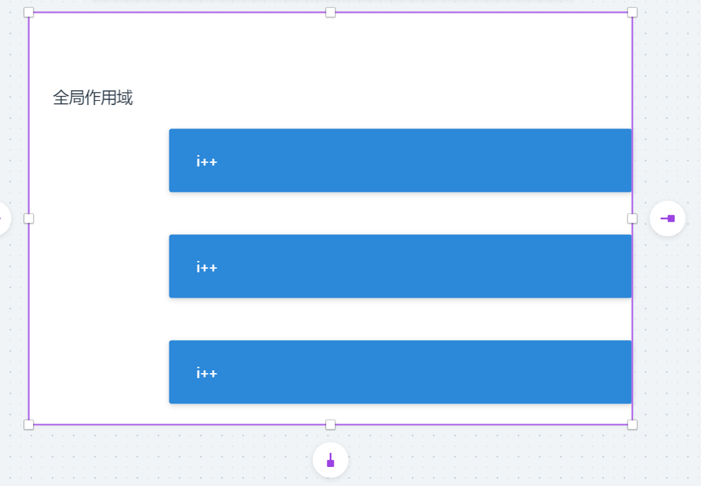

#### let-const-var在for循环中执行原理

const和let情形一样

var的情形


```js
for(var i = 0; i <= 3; i++) {
    console.log(i);
}
```

let的情形



```js
for(let i = 0; i <= 3; i++) {
    console.log(i);	
}
console.log(i) //error i is not defined
```


```js
for(let i = 0; i <= 3; i++) {
    setTimeout(() => {
        console.log(i);
    },1000)
}
console.log(i) //error i is not defined
```

