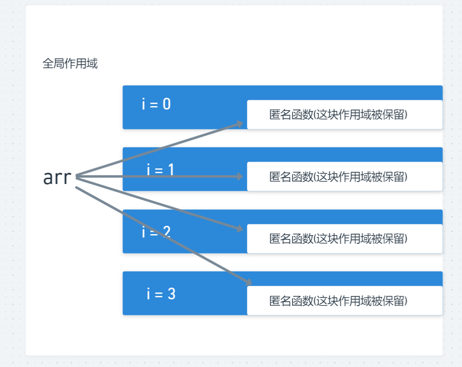
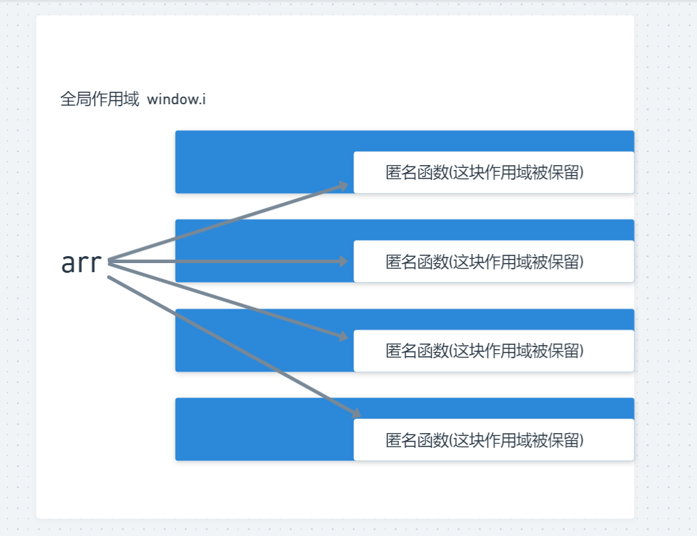
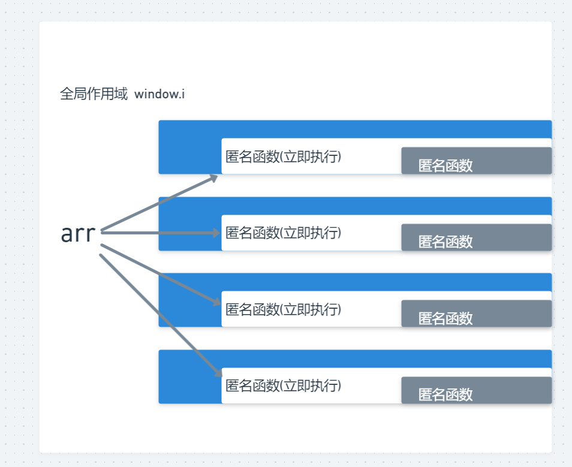

#### 多级作用域详解

let 的情形



```html
<!DOCTYPE html>
<html lang="en">
<head>
    <meta charset="UTF-8">
    <meta http-equiv="X-UA-Compatible" content="IE=edge">
    <meta name="viewport" content="width=device-width, initial-scale=1.0">
    <title>Document</title>
</head>
<body>
    
</body>
<script>
    let arr = [];
    for (let i = 0; i < 3; i++) {
        arr.push(() => {
            return i++;
        })
    }
    // 1 2 3
</script>
</html>
```

var的情形



```html
<!DOCTYPE html>
<html lang="en">
<head>
    <meta charset="UTF-8">
    <meta http-equiv="X-UA-Compatible" content="IE=edge">
    <meta name="viewport" content="width=device-width, initial-scale=1.0">
    <title>Document</title>
</head>
<body>
    
</body>
<script>
    let arr = [];
    for (var i = 0; i < 3; i++) {
        arr.push(() => {
            return i++;
        })
    }
    console.log(arr[2]())
</script>
</html>
```


var改进后



```html
<!DOCTYPE html>
<html lang="en">
<head>
    <meta charset="UTF-8">
    <meta http-equiv="X-UA-Compatible" content="IE=edge">
    <meta name="viewport" content="width=device-width, initial-scale=1.0">
    <title>Document</title>
</head>
<body>
    
</body>
<script>
    let arr = [];
    for (var i = 0; i < 3; i++) {
        (function(i){
            arr.push(() => {
                return i++;
            })
        })(i)
    }
    console.log(arr[2]())
</script>
</html>
```

