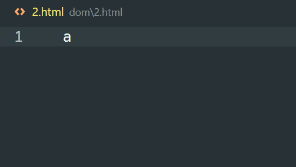
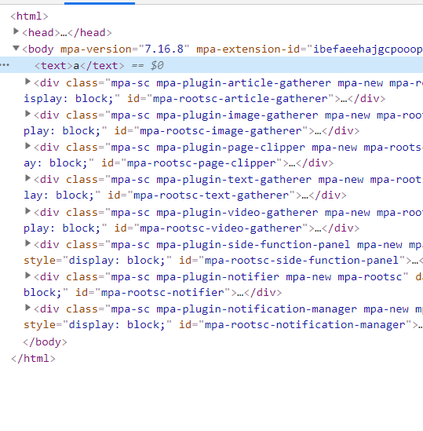

### 文档渲染和整理



文档会自动进行渲染

```html
<!DOCTYPE html>
<html lang="en">
<head>
    <meta charset="UTF-8">
    <meta http-equiv="X-UA-Compatible" content="IE=edge">
    <meta name="viewport" content="width=device-width, initial-scale=1.0">
    <title>Document</title>
</head>
<body>
    <h2 id="hd">hdcms</h2>
</body>
</html>
```

会自动整理，渲染