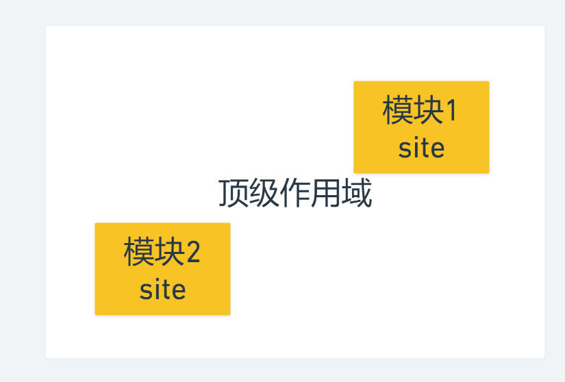

### 作用域在模块的体现



```html
<!DOCTYPE html>
<html lang="en">
<head>
    <meta charset="UTF-8">
    <meta http-equiv="X-UA-Compatible" content="IE=edge">
    <meta name="viewport" content="width=device-width, initial-scale=1.0">
    <title>Document</title>
</head>
<script type="module">
    let site = "hdcms"
    console.log(url);
</script>
<body>
    
</body>
<script type="module">
    // console.log(site);  //undefined
    console.log(url);
</script>
<script>
    let url = "https://www.baidu.com"
</script>
</html>
```

