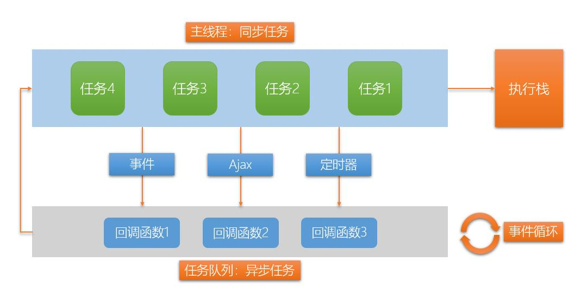
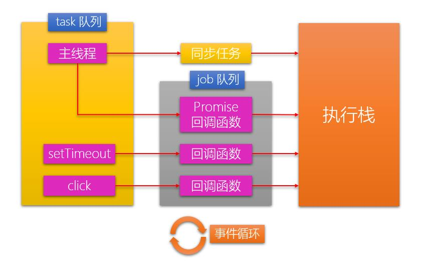
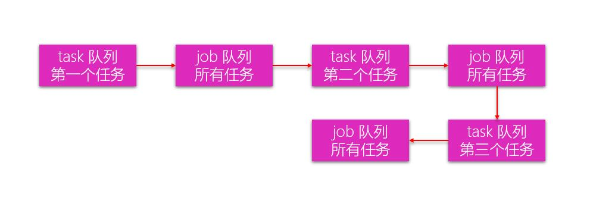

#### 什么是异步编程

js是单线程，所有的任务都要排队，前一个任务结束，才会执行后一个任务。

**任务：** 

1. 同步任务: 在主线程上排队执行的任务。

2. 异步任务：那些准备执行，被放在“任务队列”中的任务，一旦主线程所有的同步任务执行完毕，队列中的任务就会结束等待的状态，开始执行。

3. ```
   主线程从队列中读取任务的过程是循环不断的，这种运行机制称为Event Loop（事件循环）。
   ```

如果程序调用某个方法，等待其执行全部处理后才能继续执行，我们称其为**同步**的。相反，在处理完成之前就返回调用方法则是**异步**的。





