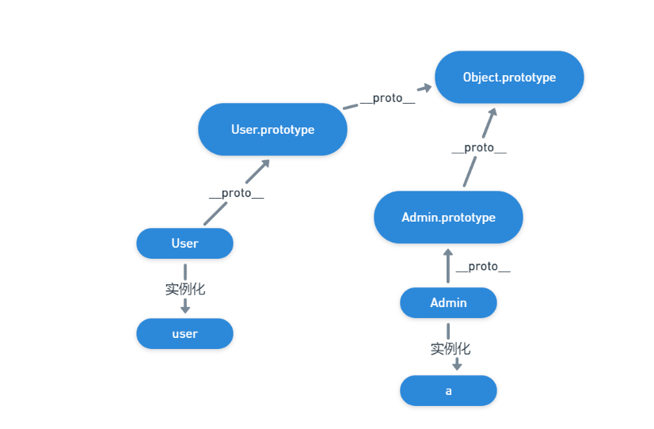
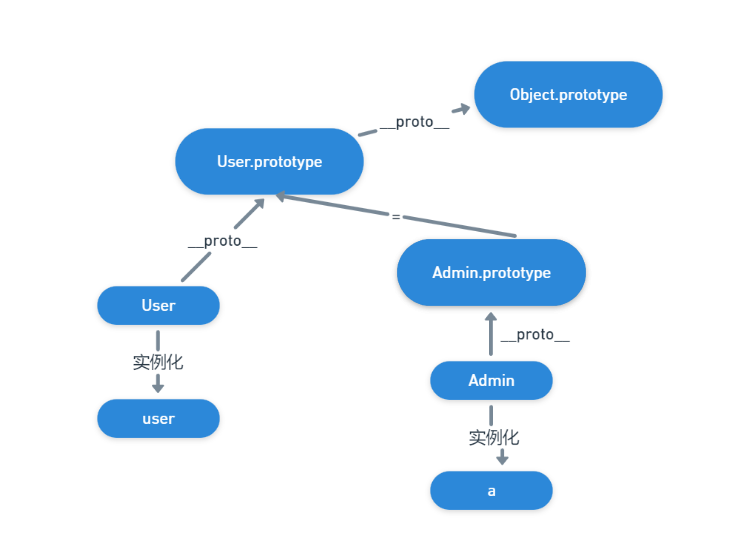

#### 继承对新增对象的影响

初始图



改变Admin.prototype指向



改变Admin.prototype.\_\_proto\_\_


```html
<!DOCTYPE html>
<html lang="en">
<head>
    <meta charset="UTF-8">
    <meta http-equiv="X-UA-Compatible" content="IE=edge">
    <meta name="viewport" content="width=device-width, initial-scale=1.0">
    <title>Document</title>
</head>
<body>
    
</body>
<script>
    function User() {}
    User.prototype.name = function() {
        console.log("user.name");
    }	

    function Admin() {}
    let a = new Admin();

    //这里改变了Admin.prototype的指向 但不会影响实例化的对象
    Admin.prototype = Object.create(User.prototype);
    Admin.prototype.role = function() {
        console.log("rule")
    }
    a.role();
    
</script>
</html>
```

