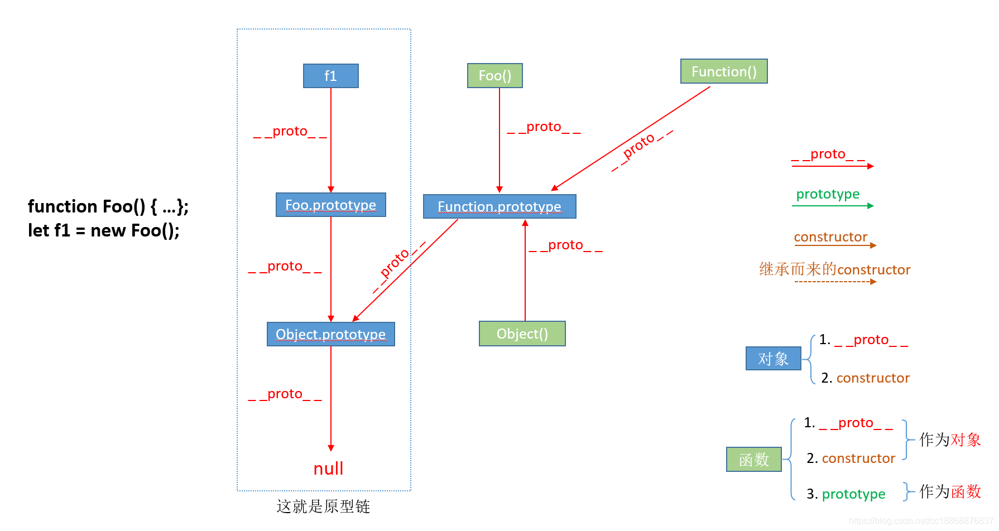
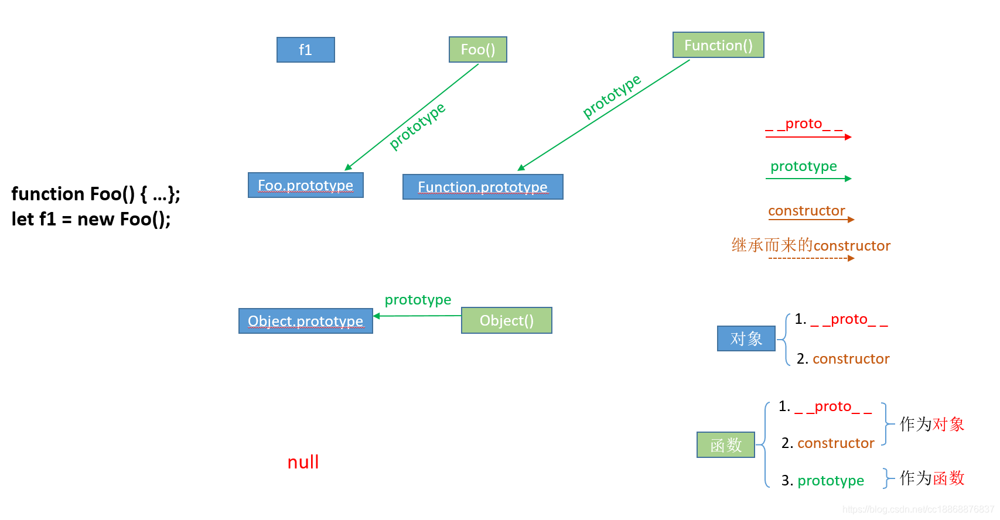
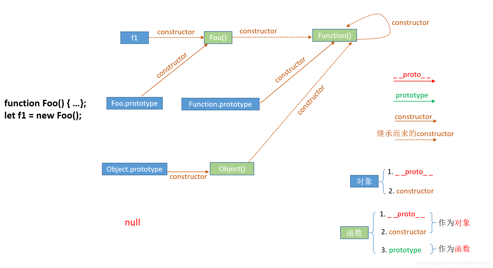
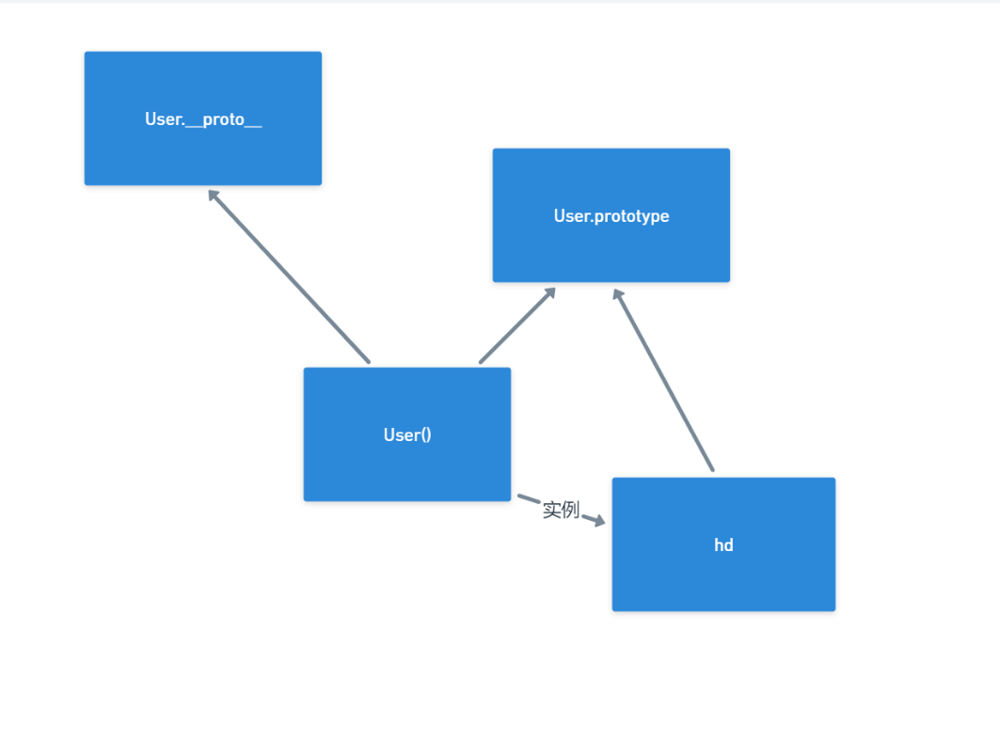

#### 函数拥有多个长辈

```js
// __proto__ 它是对象所独有的，可以看到__proto__属性都是由一个对象指向一个对象，即指向它们的原型对象（也可以理解为父对象）.通过__proto__属性来连接对象直到null的一条链即为我们所谓的原型链。

// prototype 这个是函数独有的，从一个函数指向一个对象 函数的原型对象 也就是这个函数创建的实例的原型对象，由此可得 f1.__proto__ === Foo().prototype 它的作用就是包含可以由特定类型的所有实例共享的属性和方法，也就是让该函数所实例化的对象们都可以找到公用的属性和方法。任何函数在创建的时候，其实会默认同时创建该函数的prototype对象。

```

##### // proto的事例



```js
// 这里的是__proto__属性，是对象所独有的，__proto__都是由一个对象指向另外一个对象的，即指向他们的原型对象。作用：作用就是可以当访问一个对象的属性或方法时，若本身不存在，可以到它的__proto__对象寻找，如果父对象也不存在则往父对象的__proto__对象上寻找 如此下去 一直到null为止 由以上这种通过__proto__属性来连接对象直到null的一条链即为我们所谓的原型链。
```

##### //prototype的事例



```js
//prototype属性 函数独有的 由函数指向对象 它的含义是函数的原型对象，也就是这个函数（其实所有函数都可以作为构造函数）所创建的实例的原型对象，由此可知：f1.__proto__ === Foo.prototype，它们两个完全一样。那prototype属性的作用又是什么呢？它的作用就是包含可以由特定类型的所有实例共享的属性和方法，也就是让该函数所实例化的对象们都可以找到公用的属性和方法。任何函数在创建的时候，其实会默认同时创建该函数的prototype对象。
```

##### constructor属性



```js
// constructor属性也是对象才拥有的，它是从一个对象指向一个函数，含义就是指向该对象的构造函数，每个对象都有构造函数（本身拥有或继承而来，继承而来的要结合__proto__属性查看会更清楚点，如下图所示），从上图中可以看出Function这个对象比较特殊，它的构造函数就是它自己（因为Function可以看成是一个函数，也可以是一个对象），所有函数和对象最终都是由Function构造函数得来，所以constructor属性的终点就是Function这个函数。
```


#### 总结

1. 我们需要牢记两点：①`__proto__`和`constructor`属性是**对象**所独有的；② `prototype`属性是**函数**所独有的，因为函数也是一种对象，所以函数也拥有`__proto__`和`constructor`属性。
2. `__proto__`属性的**作用**就是当访问一个对象的属性时，如果该对象内部不存在这个属性，那么就会去它的`__proto__`属性所指向的那个对象（父对象）里找，一直找，直到`__proto__`属性的终点**null**，再往上找就相当于在null上取值，会报错。通过`__proto__`属性将对象连接起来的这条链路即**我们所谓的原型链**。
3. `prototype`属性的**作用**就是让该函数所实例化的对象们都可以找到公用的属性和方法，即`f1.__proto__ === Foo.prototype`。
4. `constructor`属性的含义就是**指向该对象的构造函数**，所有函数（此时看成对象了）最终的构造函数都指向**Function**。



```html
<!DOCTYPE html>
<html lang="en">
<head>
    <meta charset="UTF-8">
    <meta http-equiv="X-UA-Compatible" content="IE=edge">
    <meta name="viewport" content="width=device-width, initial-scale=1.0">
    <title>Document</title>
</head>
<body>
    
</body>
<script>
    // 函数也是对象
    function User() {

    }
    User.prototype.show = () => {
        console.log("show")
    }
    let hd = new User();
    hd.show();
    console.dir(User);
    console.log(User.prototype === hd.__proto__);   //true
    console.log(User.__proto__ === hd.__proto__);   //false
</script>
</html>
```

