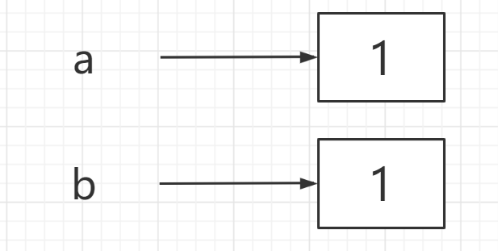
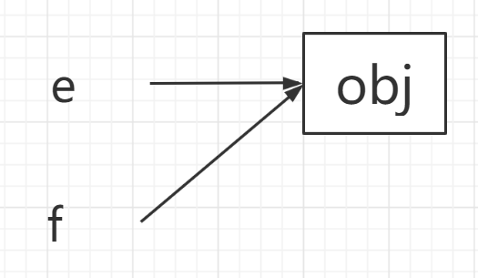

### 传值和传址

#### 传值(基本类型)

```javascript
let a = 1;
let b = 1;
console.log(a,b);	// 1 1
b = 3;
console.log(a,b);	// 1 3
// 此时会复制多一块地址出来，让b指向这个地址。
```




#### 传址(引用类型)

```js
let e = {};
let f = e;
console.log(e,f);	// {} {}
e.a = 20;
console.log(e,f);	// {a:20} {a:20}
f.b = 2;
console.log(e,f);	// {a:20,b:2} {a:20,b:2}
// 此时两个变量共同使用一块地址
```



