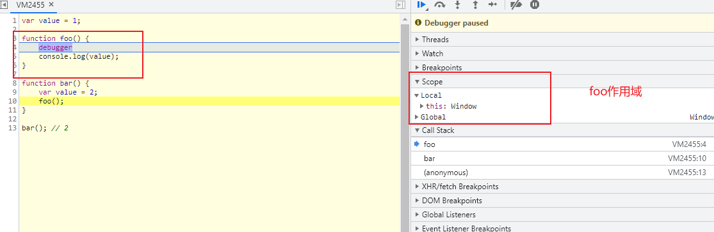
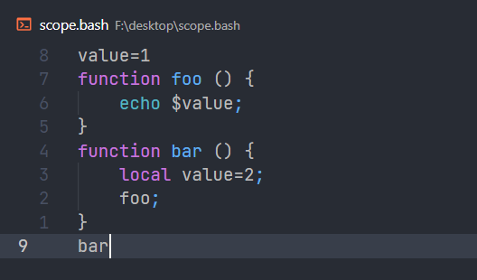
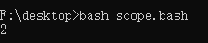
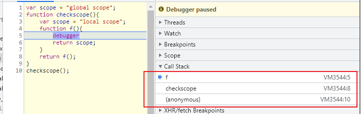
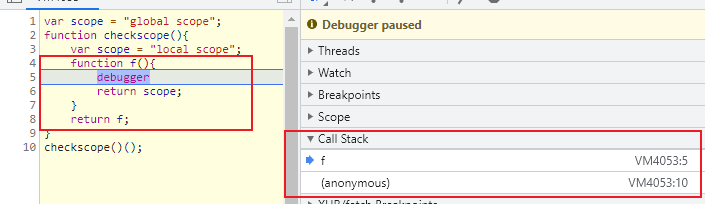

# JavaScript深入之词法作用域和动态作用域

### 参考来源

[JavaScript深入之词法作用域和动态作用域 #3]: https://github.com/mqyqingfeng/Blog/issues/3

### 作用域

作用域是指程序源代码中定义变量的区域。

作用域规定了如何查找变量，也就是确定当前执行代码对变量的访问权限。

JavaScript采用了词法作用域(lexical scoping), 即静态作用域。

### 词法作用域与动态作用域区别？

词法作用域：函数的作用域在定义的时候已经确定。

动态作用域：函数的作用域在函数调用的时候才决定。

**举个栗子🔖**

```javascript
var value = 1;

function foo() {
    console.log(value);
}

function bar() {
    var value = 2;
    foo();
}

bar(); // 1
```

结果输出为1，我们可以看得到。

那JavaScript是如何执行这个过程的呢？

1. 执行foo函数，现在foo函数中看有没有局部变量value。
2. 没有的话，按照书写的位置，查找上一层的代码，找到Global上的value，打印value，为1。



那动态作用域是如何执行的呢

- 执行foo函数，现在foo函数中看有没有局部变量value。

- 没有的话，按照调用的位置，查找上一层的函数的作用域，找到bar上的value，打印value，2。

  

  

## 动态作用域

部分语言也采用了动态作用域。

## 思考题

最后，让我们看一个《JavaScript权威指南》中的例子：

```js
var scope = "global scope";
function checkscope(){
    var scope = "local scope";
    function f(){
        return scope;
    }
    return f();
}
checkscope();
var scope = "global scope";
function checkscope(){
    var scope = "local scope";
    function f(){
        return scope;
    }
    return f;
}
checkscope()();
```

两个结果都是`local scope`;

原因均为词法作用域，函数的作用域基于函数创建的位置。

JavaScript 函数的执行用到了作用域链，这个作用域链是在函数定义的时候创建的。嵌套的函数 f() 定义在这个作用域链里，其中的变量 scope 一定是局部变量，不管何时何地执行函数 f()，这种绑定在执行 f() 时依然有效。

**虽然两段代码执行的结果一样，但是两段代码究竟有哪些不同呢？**

执行栈执行函数顺序的不同。



上图顺序：

```js
ECS.push(checkscope);
ECS.push(f);
ECS.pop();  //f
ECS.pop(); //checkscope
```



上图顺序

```js
ECS.push(checkscope);
ECS.pop();  // checkscope
ECS.push(f); // f
ECS.pop(); // checkscope
```

核心：**函数的作用域在函数定义的时候就决定了**

> Like most modern programming languages, JavaScript uses lexical scoping. This means that functions are executed using the variable scope that was in effect when they were defined, not the variable scope that is in effect when they are invoked. In order to implement lexical scoping, the internal state of a JavaScript function object must in- clude not only the code of the function but also a reference to the current scope chain. (Before reading the rest of this section, you may want to review the material on variable scope and the scope chain in §3.10 and §3.10.3.) This combination of a function object and a scope (a set of variable bindings) in which the function’s variables are resolved is called a closure in the computer science literature. (This is an old term that refers to the fact that the function’s variables have bindings in the scope chain and that therefore the function is “closed over” its variables.)

> Technically, all JavaScript functions are closures: they are objects, and they have a scope chain associated with them. Most functions are invoked using the same scope chain that was in effect when the function was defined, and it doesn’t really matter that there is a closure involved. Closures become interesting when they are invoked under a different scope chain than the one that was in effect when they were defined. This happens most commonly when a nested function object is returned from the function within which it was defined. There are a number of powerful programming techniques that involve this kind of nested function closures, and their use has become relatively common in JavaScript programming. Closures may seem confusing when you first en- counter them, but it is important that you understand them well enough to use them comfortably.

> JavaScript, The Definite Guide

在全局作用域中“定义”一个函数到时候，只会创建包含全局作用域的作用域链。这个函数会保存着对这个作用域的引用。只有“执行”该函数的时候，才会复制创建时的作用域，并将当前函数的局部作用域放在作用域链的顶端。