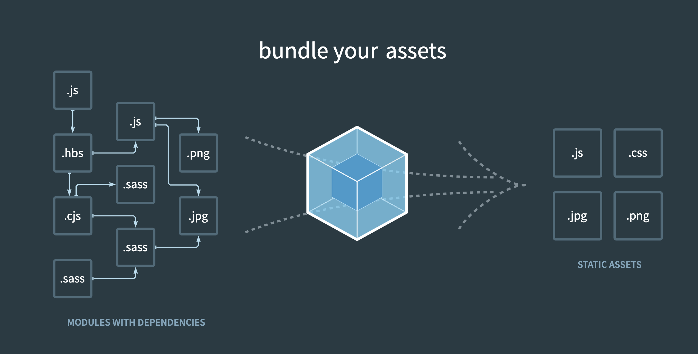
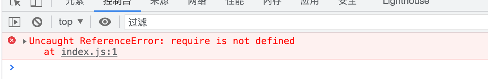

# Mini-Webpack

## What is Webpack
webpack是一个打包工具, 宗旨--“一切资源皆可打包”。



## 原理分析

在我们的日常编码过程中，其实我们的Node环境和游览器的环境所直接的模块导入是有所不同的，但我们在`webpack`中却能够进行混用`CommonJS`和`ES Module`（当然,不建议混用），其实是webpack帮我们做了工作。

我们先来看看`CommonJS`的用法。

### CommonJS例子

```js
// add.js
exports.default = function(a, b) {
  return a + b;
}

// index.js
let add = require('./add').default;

console.log(add(1, 2));
```
当我们使用`Node`运行以上代码的时候, 我们是能拿到结果的。

但当我们从游览器引入`index.js`的脚本的时候，我们会发现游览器报错。（因为游览器环境并不支持`CommonJS`的导入）。



#### 如何在游览器上使用CommonJS的写法？

参考上方，很明显，我们可以去构造`exports`对象和`require`函数，使得游览器上可以运行。

##### 模拟`exports`对象

- 我们先简易实现一个`export`对象，下方的代码能完成要求，但会**污染全局**。

  ```html
  <script>
    // bundle.js 整合代码 统一输出 + 可运行
  
    let exports = {};
    exports.default = function (a, b) {
      return a + b;
    }
  </script>
  ```

- 为了解决上方的污染全局的问题，我们采用**自执行函数**.

  ```html
  <script>
    // bundle.js 整合代码 统一输出 + 可运行
  
    let exports = {};
    let code = "exports.default = function (a, b) { return a + b; }";
  
    (function (exports, code) {
      eval(code)
    })(exports, code);
  
    console.log(exports.default(1, 2));
  </script>
  ```

##### 模拟`require`函数

我们思考一下, `require`函数怎么实现。

实质上，可以简单理解为输入`文件路径`参数，获得该文件导出的`对象`。

我们一步一步来。

- 首先，我们只搭建大概的函数的样子，`文件路径`输入，`对象`输出。

  ```html
  <script>
    // bundle.js 整合代码 统一输出 + 可运行
  
    function require(file) {
      let exports = {};
      let code = "exports.default = function (a, b) { return a + b; }";
  
      (function (exports, code) {
        eval(code)
      })(exports, code);
  
      return exports;
    }
  
    let add = require('./add.js').default;
    console.log(add(1, 5));
  </script>
  ```

- 下面我们完善一下`require`代码，并且让他自动执行。

  ```html
  <script>
    // bundle.js 整合代码 统一输出 + 可运行
  
    const list = {
      'add.js': `exports.default = function (a, b) { return a + b; }`,
      'index.js': `let add = require('add.js').default;
            console.log(add(1, 2));`
    };
  
    (function(list) {
      function require(file) {
        let exports = {};
        let code = list[file];
  
        (function (exports, code) {
          eval(code)
        })(exports, code);
  
        return exports;
      }
  
      // 入口
      require('index.js')
    })(list);
  
  </script>
  ```

  其实上方就是一个简易的`webpack`打包之后的结果。实质上，`webpack`也是让`CommonJS`拼接成类似上方的代码进行输出。

  当然`webpack`中使用的是`依赖图`，而不是简单的列表。

总之,`webpack`的打包可拆分为三个模块：

1. 分析依赖
2. ES6转ES5
3. 替换exports和require

## 功能实现


